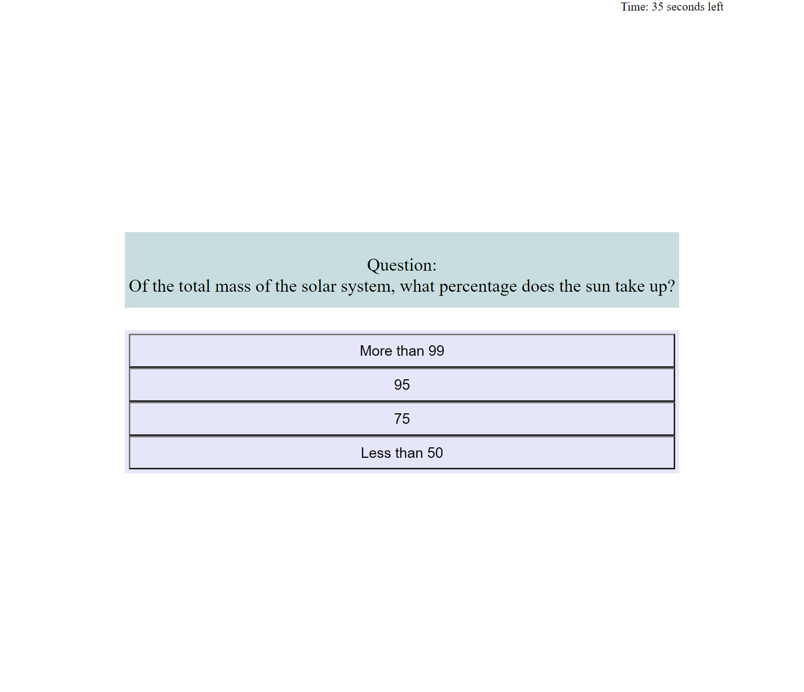

# QuizGame
Du homework week 4, making a simple javascript quiz game, built with JavaScript, HTML, and CSS.

# Description
The main goal was to make a simple quiz using javascript, checking for correct answers and subtracting time on wrong answers. Important to include a highscore at the end that saves to local storage and takes them from storage on page load.

# View
Full page can be found at https://skerans.github.io/QuizGame/

# Sources

Shout out for code used to shuffle my question array
http://sedition.com/perl/javascript-fy.html
